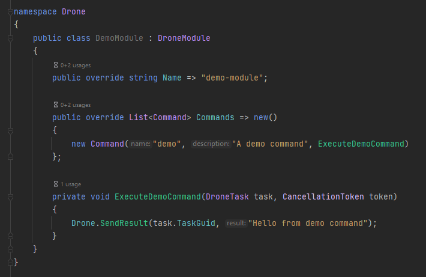

# Customising

## Custom C2 Handlers

A C2 handler is a means by which a drone communicates with the team server or another P2P drone.

### TeamServer

A handler can be implemented directly into the existing team server project or as a standalone DLL.  The advantage of a DLL is that it's more easily shareable.

Create a .NET Class Library and add the team server as a reference.
Create your new handler class and have it inherit from `Handler`.


Your job is to provide overrides for `Name`, `Parameters`, `Start` and `Stop`.

- `Name` is the name of the handler as it appears in the client.
- `Parameters` is a list of `HandlerParameter`.  Each parameter has a name, a default value and whether or not it's optional.  These parameters appear in the client when configuring the handler.
- Even though `Start` is a `virtual`, it should be overridden and `base.Start();` called before anything else.  The base implementation ensures that all mandatory parameters have been supplied before continuing.

When a drone checks in, you should recover the `DroneMetadata` and pass it to `TaskService.GetDroneTasks(metadata);` to get any tasks pending for it.
Equally, if the drone is sending data, it should be reconstructed to an `IEnumerable<C2Message>` and passed to `TaskService.RecvC2Data(messages);`.
Once compiled, you can start the team server with the `-h` (--handler) option to load it.

### Drone

Presently, custom handlers for the drone can only be implemented directly within the drone project.  However, the implementation is practically identical.  Create a new handler class, inherit from `Handler` and provide overrides for `Name`, `Start` and `Stop`.

```{admonition} Important!
:class: warning

It's vital that the matching handlers on the team server and drone have the same `Name`.
This is used by dnlib to embed the parameters from the correct handler on the team server into the drone during payload generation.
```


To check if there are any messages to send, use `OutboundQueue.IsEmpty`.  If there are, get an `IEnumerable<C2Message>` with `GetOutboundQueue()`.  This data can be transformed into whatever format is appropriate for your handler.
After talking to the team server and receiving an `IEnumerable<C2Message>`, iterate over each one and call `InboundQueue.Enqueue(message)` for them to be processed by the drone.

You will then need to compile the drone to a new DLL (with the Release configuration) and place it in the team server's `Resources` directory:  [https://github.com/SharpC2/SharpC2/tree/main/TeamServer/Resources](https://github.com/SharpC2/SharpC2/tree/main/TeamServer/Resources)

## Custom Drone Modules

Drone modules can be used to provide additional functionality to a drone.  As with handlers, a module can be written directly into the Drone or as a standalone DLL.
If implemented as a standalone DLL, these can be pushed to the drone during runtime (via the `load-module` command in the client).

Create a new .NET (Framework or Standard) Class Library and add the drone project as a reference.


Create your drone module class and inherit from `DroneModule`.  A single module can have multiple commands.  The `name` and `description` of each command will be shown in the client.



You may add arguments to a command like:

```c#
public override List<Command> Commands => new List<Command>()
{
    new ("demo", "A demo command", ExecuteDemoCommand, new List<Command.Argument>
    {
        new("pid", optional: false)
    })
};
```

An argument has a `label`, can be `optional`, and can be an `artefact`.  An artefact is a data blob sent with the task (think `execute-assembly` etc).
Once the module is loaded, the new command(s) will be available.

### API Hooking

The drone is compiled with [MinHook.NET](https://github.com/CCob/MinHook.NET), the engine for which is exposed as a protected field within the `DroneModule` abstract class, called `Hooks`.

You must define a delegate and a detour method.  It's also a good idea to store a reference to the original hooked function so it can be restored.  A complete implemention could look something like this:

```c#
using System;
using System.Collections.Generic;
using System.Runtime.InteropServices;
using System.Threading;

using Drone.Models;
using Drone.Modules;

namespace Drone
{
    public class DemoModule : DroneModule
    {
        public override string Name => "demo-module";

        public override List<Command> Commands => new List<Command>()
        {
            new ("hook-msgbox", "Hook the MessageBox API", HookMessageBox),
            new ("unhook-msgbox", "UnHook the MessageBox API", UnHookMessageBox)
        };

        private MessageBoxWDelegate _messageBoxWOriginal;

        private void HookMessageBox(DroneTask task, CancellationToken token)
        {
            _messageBoxWOriginal ??= Hooks.CreateHook(
                "user32.dll",
                "MessageBoxW",
                new MessageBoxWDelegate(MessageBoxWDetour));

            Hooks.EnableHook(_messageBoxWOriginal);
        }
        
        private void UnHookMessageBox(DroneTask task, CancellationToken token)
        {
            if (_messageBoxWOriginal is not null)
            {
                Hooks.DisableHook(_messageBoxWOriginal);
            }
        }

        private int MessageBoxWDetour(IntPtr hWnd, string text, string caption, uint type)
            => _messageBoxWOriginal(hWnd, "HOOKED!", caption, type);

        [UnmanagedFunctionPointer(CallingConvention.StdCall, CharSet = CharSet.Unicode)]
        private delegate int MessageBoxWDelegate(IntPtr hWnd, string text, string caption, uint type);
    }
}
```