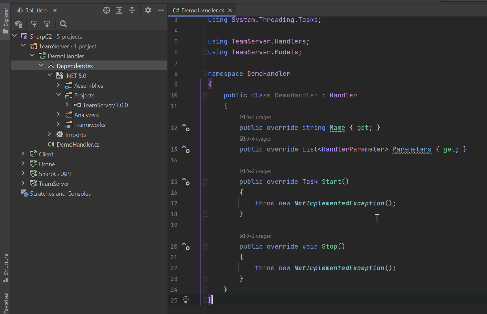
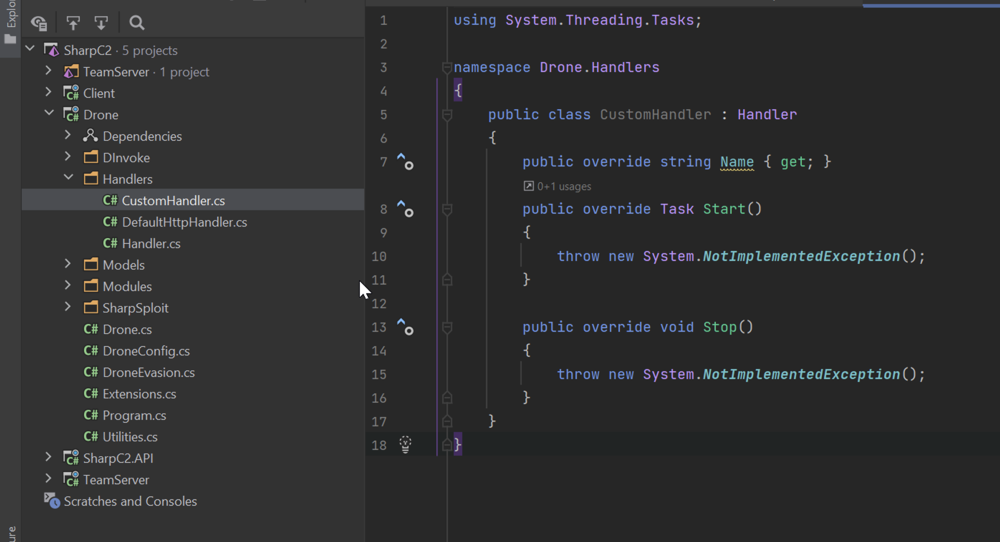
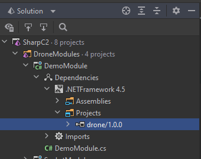
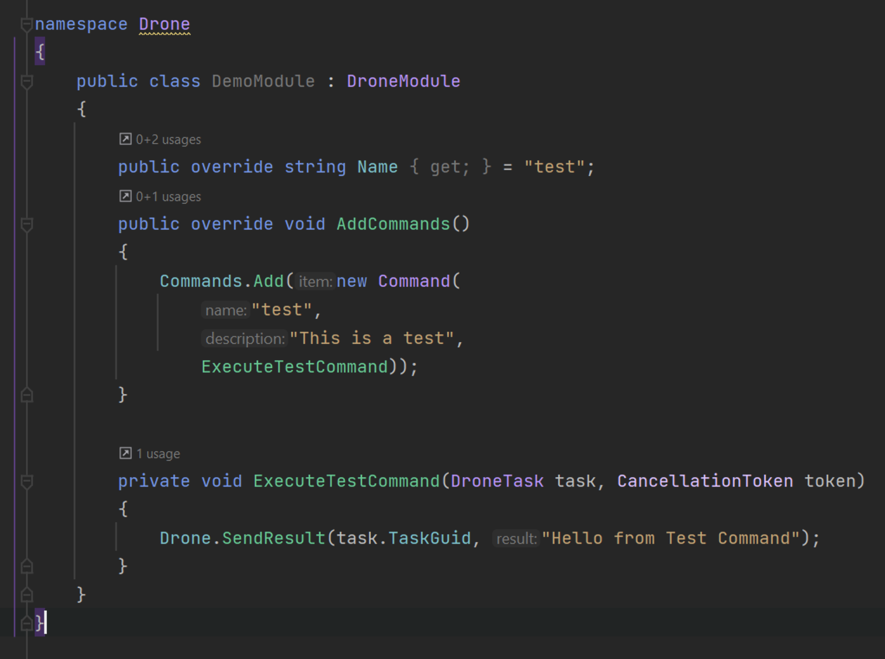

# Extending

## Custom C2 Handlers

A C2 Handler is a means by which a Drone communicates with the Team Server (and one day Drone-to-Drone as well).

### TeamServer

A Handler can be implemented directly into the existing TeamServer project or as a standalone DLL.  The advantage of a DLL is that it's more easily shareable.

Create a .NET Class Library and add the TeamServer as a reference.
Create your new handler class and have it inherit from ``Handler``.



Your job is to provide overrides for ``Name``, ``Parameters``, ``Start`` and ``Stop``.

- ``Name`` is the name of the handler as it appears in the client.
- ``Parameters`` is a list of ``HandlerParameter``.  Each parameter has a name, a default value and whether or not it's optional.  These parameters appear in the client when configuring the handler.
- Even though ``Start`` is a ``virtual``, it should be overridden and ``base.Start();`` called before anything else.  The base implementation ensures that all mandatory parameters have been supplied before continuing.

When a Drone "checks-in", you should recover the ``DroneMetadata`` and pass it to ``TaskService.GetDroneTasks(metadata);`` to get any tasks pending for it.
Equally, if the Drone is "sending data", it should be reconstructed to an ``IEnumerable<C2Message>`` and passed to ``TaskService.RecvC2Data(messages);``.

Once compiled, you can start the team server like: ``sudo ./TeamServer [password] </path/to/custom-handler.dll>`` to load it.

### Drone

Presently, custom handlers for the Drone can only be implemented directly within the Drone project.  However, implementation is practically identical.  Create a new handler class, inherit from ``Handler`` and provide overrides for ``Name``, ``Start`` and ``Stop``.

```{admonition} Important!
:class: warning

It's vital that the matching Handlers on the team server and Drone have the same ``Name``.
This is used by dnlib to embed the parameters from the correct Handler on the team server into the Drone during payload generation.
```



To check if there are any messages to send, use ``OutboundQueue.IsEmpty``.  If false, get an ``IEnumerable<C2Message>`` with ``GetOutboundQueue()``.  This data can be transformed into whatever format is appropriate for your Handler.
After talking to the team server and receiving an ``IEnumerable<C2Message>``, iterate over each one and call ``InboundQueue.Enqueue(message)`` for them to be processed by the Drone.

You will then need to compile the Drone to a new DLL (with the Release configuration) and place it in the team server's ``Resources`` directory:  [https://github.com/SharpC2/SharpC2/tree/main/TeamServer/Resources](https://github.com/SharpC2/SharpC2/tree/main/TeamServer/Resources)


## Custom Drone Modules

Drone modules can be used to provide additional functionality to a Drone.  As with Handlers, a module can be written directly into the Drone or as a standalone DLL.
If implemented as a standalone DLL, these can be pushed to the Drone during runtime (via the ``load-module`` command in the client).

Create a new .NET (Framework) Class Library and add the Drone project as a reference.  Create your drone module class and inherit from ``DroneModule``.



A single module can have multiple commands.  The ``name`` and ``description`` of each command will be shown in the client.



You may add arguments to a command like:

```c#
var command = new Command();
command.Arguments.Add(new Command.Argument());
```

An argument has a label, can be optional or mandatory, and can be an artefact.  An artefact is a data blob sent with the task (think `execute-assembly` etc).

```text
[7c7a5403ed] # load-module /Users/rasta/Desktop/DemoModule.dll
[+] Drone tasked: b3b6615656

[7c7a5403ed] # [+] Drone checked in. Sent 6924 bytes.
[+] Output received:
Module DemoModule loaded.
[+] Task complete.
```

Once the module is loaded, the new command(s) will be available.

```text
[7c7a5403ed] # help

Name              Description
----              -----------
test              This is a test

[7c7a5403ed] # help test
This is a test
Usage: test

[7c7a5403ed] # test
[+] Drone tasked: acb1c6aa43
[7c7a5403ed] # [+] Drone checked in. Sent 89 bytes.
[+] Output received:
Hello from Test Command
[+] Task complete.
```